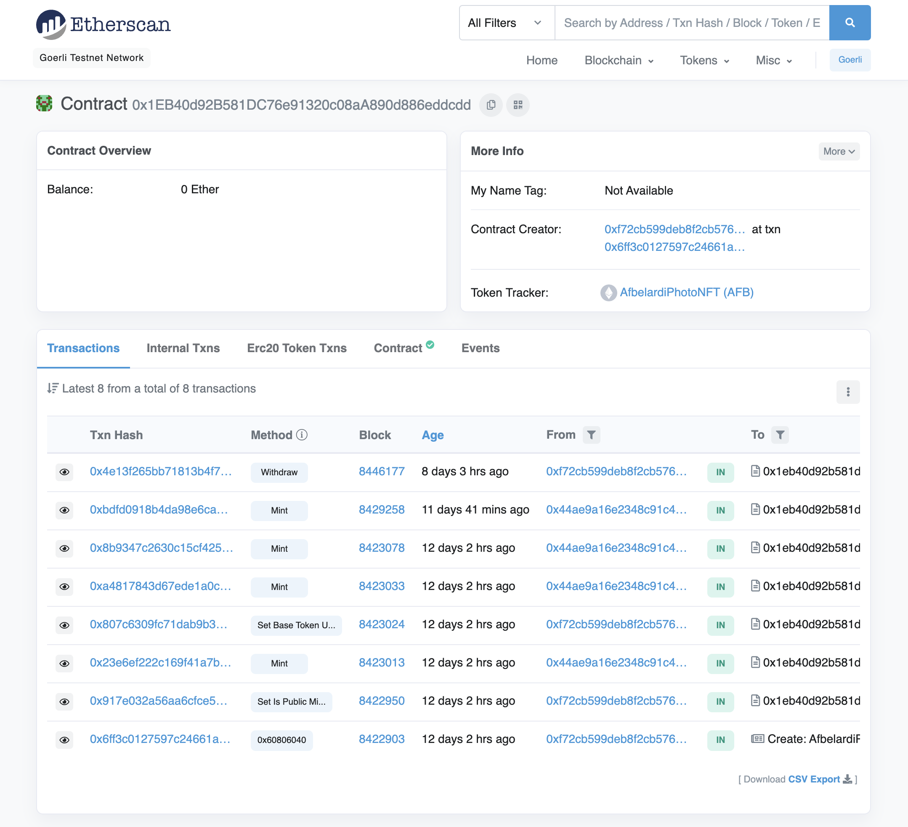

# Sample React/Solidity/Hardhat Project

This project, built with Create React App, showcases photos that I took that are part of an NFT collection. The repository includes a smart contract written in Solidity that has functions for minting, setting the baseURI, withdrawing the balance from the contract and more. 

The smart contract is deployed on the Goerli testnet. It is linked through Etherscan on the site. Users can connect their Goerli wallet, mint photos that are part of the collection and view the transaction on Etherscan. The collection of NFTs with the metadata can then be viewed on Opensea.



Try running some of the following tasks:

```shell
npx hardhat help
npx hardhat test
REPORT_GAS=true npx hardhat test
npx hardhat node
npx hardhat run scripts/deploy.js
```
